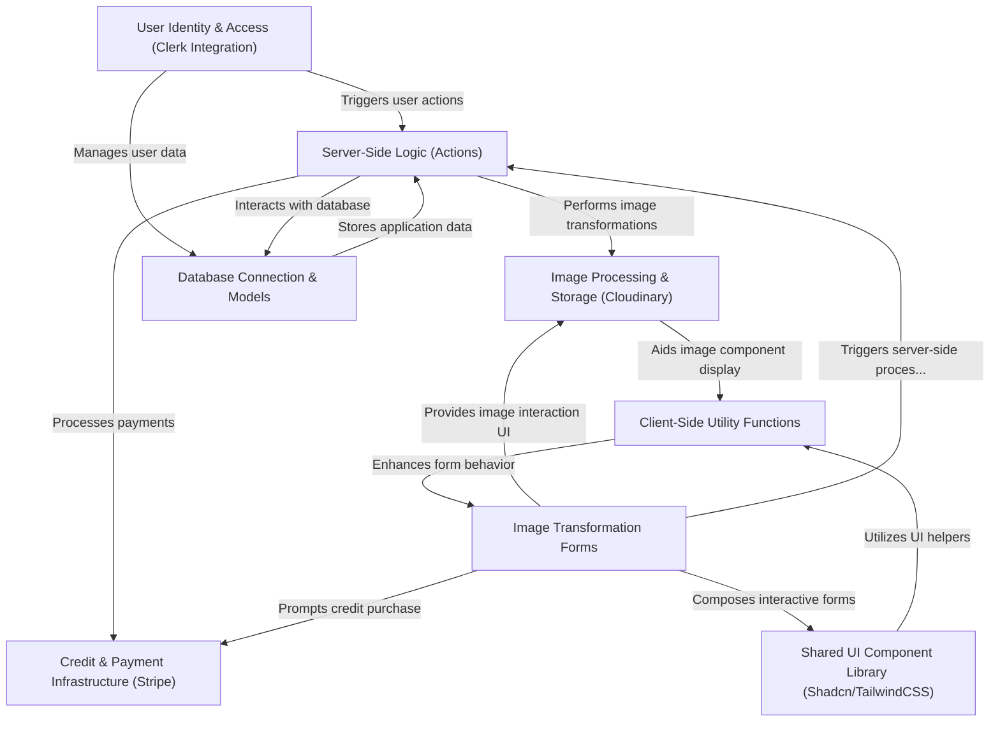

# Imaginify
🤖 Introduction
Build an AI image SaaS platform that excels in image processing capabilities, integrates a secure payment infrastructure, offers advanced image search functionalities, and supports multiple AI features, including image restoration, recoloring, object removal, generative filling, and background removal. This project can be a guide for your next AI image tool and a boost to your portfolio.

Imaginify is an **AI-powered SaaS platform** designed for *advanced image manipulation*. It enables users to perform various AI transformations like *restoring, recoloring, and removing backgrounds* from images. Users manage their access through a **secure authentication system** and purchase credits via a *payment infrastructure* to utilize these powerful AI features, all presented through a *consistent, user-friendly interface*.

## Visual Overview

⚙️ Tech Stack
Next.js
TypeScript
MongoDB
Clerk
Cloudinary
Stripe
Shadcn
TailwindCSS
🔋 Features
👉 Authentication and Authorization: Secure user access with registration, login, and route protection.

👉 Community Image Showcase: Explore user transformations with easy navigation using pagination

👉 Advanced Image Search: Find images by content or objects present inside the image quickly and accurately

👉 Image Restoration: Revive old or damaged images effortlessly

👉 Image Recoloring: Customize images by replacing objects with desired colors easily

👉 Image Generative Fill: Fill in missing areas of images seamlessly

👉 Object Removal: Clean up images by removing unwanted objects with precision

👉 Background Removal: Extract objects from backgrounds with ease

👉 Download Transformed Images: Save and share AI-transformed images conveniently

👉 Transformed Image Details: View details of transformations for each image

👉 Transformation Management: Control over deletion and updates of transformations

👉 Credits System: Earn or purchase credits for image transformations

👉 Profile Page: Access transformed images and credit information personally

👉 Credits Purchase: Securely buy credits via Stripe for uninterrupted use

👉 Responsive UI/UX: A seamless experience across devices with a user-friendly interface

and many more, including code architecture and reusability

